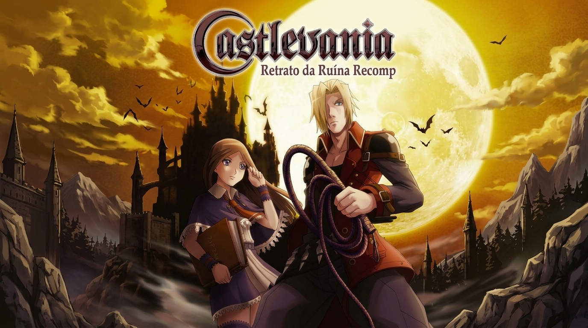
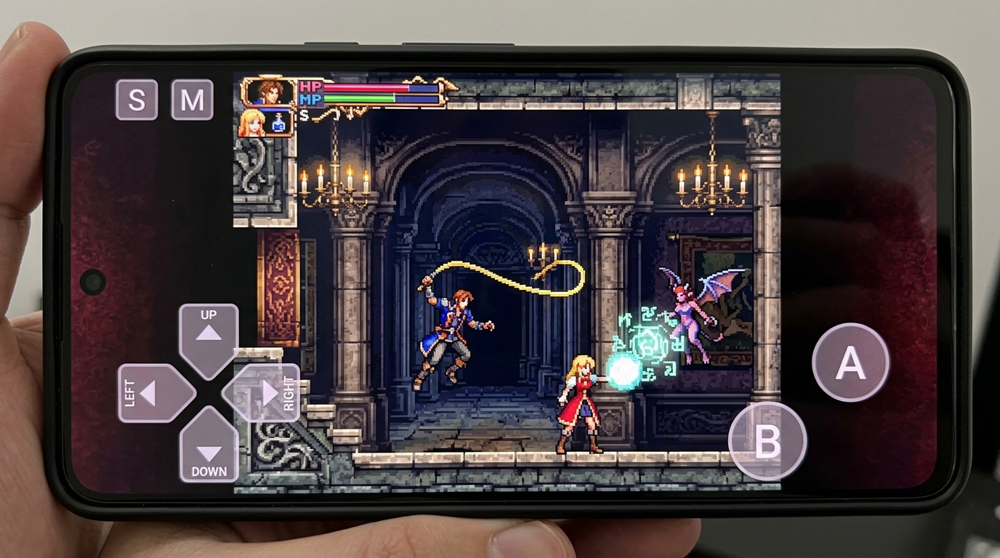
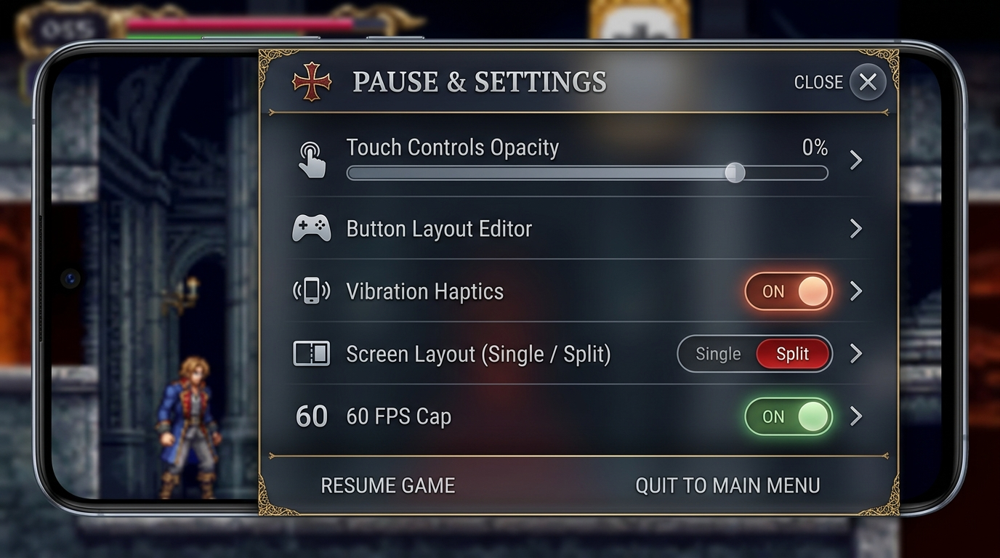

# Castlevania: Portrait of Ruin —  (NDS Recomp)

<div align="center">



[](https://www.android.com/)
[](https://developer.android.com/ndk)
[](https://github.com/RetroPortingToolKit/ndsrecomp)
[](https://github.com/features/actions)
[](LICENSE)

**Port nativo para Android de Castlevania: Portrait of Ruin baseado em Recompilação Estática (AOT) de Nintendo DS.**  
*Sem emulação pesada tradicional — código ARM executado diretamente em C++ nativo a 60 FPS estáveis.*

[Visão Geral](#-visão-geral) • [Screenshots](#-capturas-de-tela) • [Recursos](#-recursos-do-port) • [Instalação](#-como-instalar-e-jogar) • [Compilação](#-compilação-local) • [Créditos](#-créditos-e-reconhecimento) • [Aviso Legal](#-aviso-legal)

</div>

---

## 📖 Visão Geral

Este projeto traz uma experiência nativa de **Castlevania: Portrait of Ruin** para dispositivos móveis **Android**. Ao contrário de emuladores convencionais (que interpretam instruções ou recompilam dinamicamente bloco por bloco via JIT em tempo real), este port utiliza a técnica pioneira de **recompilação estática de binários (AOT)**.

Os binários de máquina dos processadores **ARM946E-S** (jogo/lógica principal) e **ARM7TDMI** (áudio/subsistemas) foram traduzidos previamente em código **C++ nativo otimizado**, que é compilado diretamente para a arquitetura **ARM64-v8a** do seu smartphone.

O resultado é um consumo mínimo de bateria, tempo de resposta instantâneo, latência zero de entrada e framerate cravado em **60 FPS** com sincronismo de áudio e vídeo perfeito.

---

## 📸 Capturas de Tela

<div align="center">

### Gameplay Nativo com Controles Virtuais no Android


### Menu de Configurações, Opacidade e Ajustes de Display


</div>

---

## ⚡ Recursos do Port

- 🚀 **Performance Nativa (60 FPS):** Execução direta em C++ ARM64 sem a sobrecarga de interpretadores.
- 🎮 **Controles Virtuais Customizados:**
  - D-Pad responsivo e botões táteis dedicados para Pulo, Ataque, Troca de Parceiro (Jonathan / Charlotte), Sub-armas e Backdash.
  - Botão de acesso rápido para visualização do Mapa / Segunda Tela.
  - Opacidade ajustável e modo de edição de posições na tela.
  - **Feedback Háptico (Vibração):** Resposta tátil ao pressionar botões em dispositivos compatíveis.
- 🕹️ **Suporte a Gamepads Físicos:**
  - Compatibilidade completa com controles Bluetooth e USB OTG (Xbox, DualShock/DualSense, 8BitDo, etc.) via backend SDL2.
- 📺 **Modos de Exibição:**
  - Visualização em tela única ampla imersiva (cortando bordas e aproveitando o display do celular).
  - Troca dinâmica para a tela secundária (Touch/Status/Mapa) via botão na tela ou controle.
- 📁 **Seletor de ROM Inteligente (SAF):**
  - O aplicativo não inclui ROM proprietária. Você pode selecionar sua própria cópia limpa do jogo diretamente pelo seletor de arquivos do Android.
  - Verificação automática da integridade da ROM via hash SHA-1.
- 💾 **Salvamento Persistente:**
  - Sistema de save integrado compatível com o formato original de EEPROM/Flash do Nintendo DS.

---

## 📥 Como Instalar e Jogar

1. Acesse a aba **[Releases](https://github.com/)** deste repositório.
2. Baixe o arquivo mais recente: `CastlevaniaPoR-Android-arm64-v8a.apk`.
3. Instale o APK no seu smartphone Android (habilite a permissão de fontes desconhecidas se solicitado).
4. Abra o aplicativo **Castlevania PoR**.
5. Na primeira inicialização, toque em **"SELECIONAR ROM"**.
6. Escolha o arquivo da sua ROM limpa e legalmente adquirida de **Castlevania: Portrait of Ruin (USA)** (`.nds`).
   - **Hash SHA-1 obrigatório:** `c1fb223c706be6efd66827675eff2360a1605cdc`
7. A ROM será validada e copiada de forma segura para os dados privados do app. O jogo iniciará imediatamente!

---

## 🛠️ Arquitetura do Projeto

```
RECOMP-NDS/
├── android/                    # Projeto Android completo (Gradle, NDK, C++ CMake, Java/JNI)
│   ├── app/
│   │   ├── src/main/java/      # Atividades Java, Camada de Controles Virtuais, SDLActivity
│   │   ├── src/main/res/       # Layouts, recursos visuais, botões táteis e ícones
│   │   └── src/main/cpp/       # CMakeLists nativo para compilação JNI
│   └── thirdparty/SDL2/        # Biblioteca SDL2 otimizada para Android
├── ndsrecomp/                  # Motor de Recompilação Estática NDS e Runtime Runner
│   ├── recompiler/             # Descompilador e emissor de código C++ (ARMv4T / ARMv5TE)
│   └── runner/                 # Runtime com subsistemas de memória, áudio, GPU e scheduler
├── por_recomp/                 # Módulo específico de Castlevania: Portrait of Ruin
│   ├── config/                 # Tabelas de mapeamento de funções e overlays
│   ├── game.toml               # Configurações do jogo (display, save EEPROM, SHA-1)
│   └── generated/              # Bancos de código C++ recompilados (ARM7 e ARM9)
├── recomp-ui/                  # Interface de usuário do ecossistema Recomp
├── docs/images/                # Banners e screenshots demonstrativas para a documentação
└── .github/workflows/          # Workflow de CI/CD automatizado para compilar e publicar APK
```

---

## 💻 Compilação Local

### Pré-requisitos
- **Android Studio** Hedgehog / Iguana / Jellyfish ou superior.
- **Android SDK** com Build Tools 34 e plataforma API 34 instalados.
- **Android NDK** versão `26.1.10909125`.
- **CMake** versão `3.22.1` ou superior.
- **JDK** versão 17.

### Passo a Passo
1. Clone o repositório com os submódulos:
   ```bash
   git clone --recursive https://github.com/<SEU_USUARIO>/RECOMP-NDS.git
   cd RECOMP-NDS
   ```

2. Entre no diretório do projeto Android:
   ```bash
   cd android
   ```

3. Compile a versão de Release:
   ```bash
   ./gradlew assembleRelease
   ```

4. O APK gerado estará disponível em:
   ```
   android/app/build/outputs/apk/release/app-release.apk
   ```

---

## 🤖 CI/CD Automatizado (GitHub Actions)

O repositório já inclui um fluxo de trabalho completo em [`.github/workflows/android-release.yml`](.github/workflows/android-release.yml).

### Como criar uma Release automaticamente:
- Basta criar e enviar uma tag com o prefixo `v`:
  ```bash
  git tag v1.0.0
  git push origin v1.0.0
  ```
- O GitHub Actions irá:
  1. Configurar o ambiente com Java 17, Android SDK e NDK 26.
  2. Compilar o runner nativo em C++ e empacotar o APK.
  3. Gerar os hashes de integridade SHA-256.
  4. Publicar automaticamente uma **nova Release no GitHub** com o arquivo `.apk` pronto para download!

---

## 🏆 Créditos e Reconhecimento

O desenvolvimento deste port só foi possível graças ao trabalho pioneiro e brilhante da comunidade de engenharia reversa e preservação:

- **[Matthew Stanley (mstan)](https://github.com/mstan)** & **[RetroPortingToolkit](https://retroportingtoolkit.com/):**
  - Criador e desenvolvedor do **[ndsrecomp](https://github.com/RetroPortingToolKit/ndsrecomp)**, o motor revolucionário de recompilação estática de binários Nintendo DS para código C++ nativo.
  - Desenvolvedor do [recomp-ui](https://github.com/RetroPortingToolkit/recomp-ui) e ecossistema associado.
- **Equipe melonDS:**
  - Pelo extraordinário emulador de código aberto melonDS, cujas arquiteturas de precisão de hardware, barramentos e GPU3D serviram de base para o subsistema do runner.
- **Equipe libSDL (SDL2):**
  - Por viabilizar a camada de entrada, áudio e vídeo multiplataforma no Android.
- **Comunidade de Recompilação Estática:**
  - Inspirado pelas inovações de projetos como *N64Recomp* (Mr-Wiseguy) e a linhagem de recompiladores modernos de consoles clássicos.

---

## ⚖️ Aviso Legal

*Este projeto é uma ferramenta de pesquisa, preservação e portabilidade de software desenvolvida através de engenharia reversa e recompilação estática de código aberto.*

- **Nenhum arquivo proprietário**, ROM protegida por direitos autorais, imagem de BIOS ou asset original da Konami Digital Entertainment ou Nintendo Co., Ltd. é distribuído neste repositório ou nos pacotes de instalação.
- Todos os usuários devem fornecer sua própria cópia legítima do jogo original (*Castlevania: Portrait of Ruin*) obtida a partir de um cartucho de sua propriedade.
- Todas as marcas registradas, títulos de jogos e direitos autorais pertencem a seus respectivos detentores.
